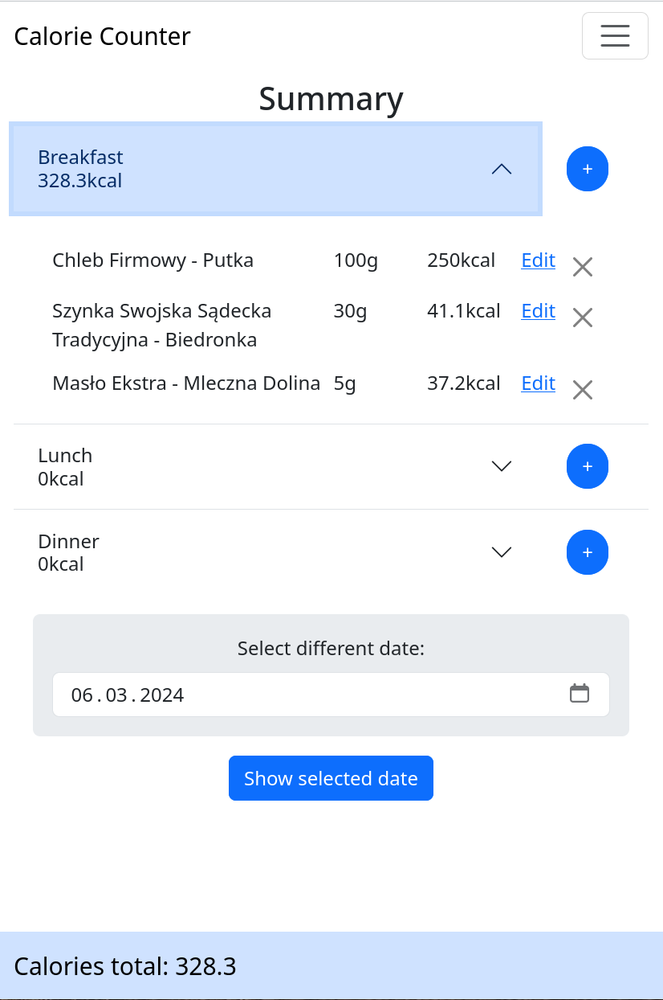

# Calorie Counter
Web app made with Python and Flask designed to track your calories. Similar to myFitnessPal or Fitatu.  
[Test it here](https://www.mysliwczykrafal.pl/caloriecounter/)  
  

## Tech stack
* Python
* Flask
* SQLite
* bootstrap
* nginx
* uWsgi 
* (was) AWS (now) self-hosted (www.mysliwczykrafal.pl)

## Main features
* Adding/removing meals either by text search or barcode scanning
* Calculating per meal calories based on input weight and database of nutritional values
* User accounts and user authentication

## Credits
[html5-qrcode](https://github.com/mebjas/html5-qrcode) for barcode scanning
